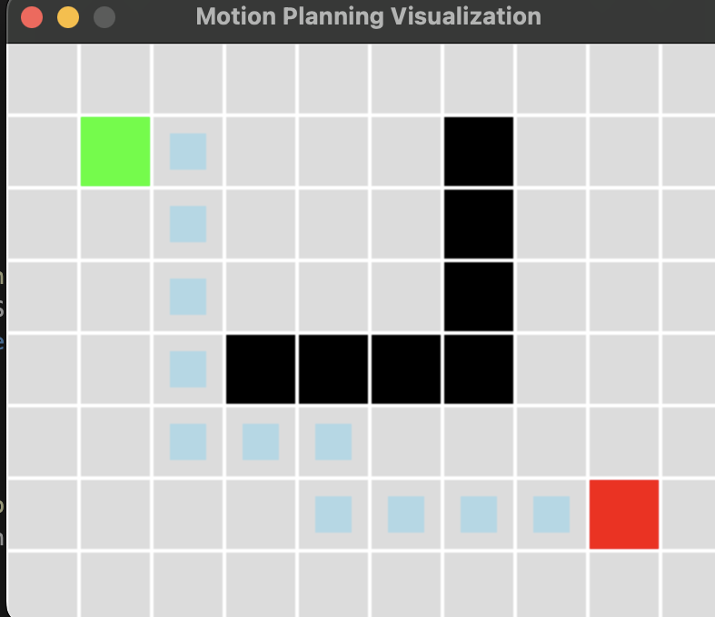

# 2D Motion Planning Algorithms

A C++ implementation of motion planning algorithms for 2D grid environments with both ASCII and graphical visualization using SDL2.



## Features

- **A* Search Algorithm** - Optimal pathfinding with heuristic
- **Dijkstra's Algorithm** - Optimal pathfinding without heuristic
- **ASCII Visualization** - Terminal-based grid display
- **SDL2 Visualization** - Animated graphical display showing agent movement
- **Modular Design** - Easy to extend with new algorithms

## Project Structure

```
2D-motion-planning/
├── include/           # Header files
│   ├── grid.hpp      # Grid representation
│   ├── planner.hpp   # Base planner class
│   ├── astar.hpp     # A* algorithm
│   ├── dijkstra.hpp  # Dijkstra algorithm
│   └── visualize.hpp # SDL2 visualization
├── src/              # Source files
│   ├── main.cpp      # Main program
│   ├── grid.cpp      # Grid implementation
│   ├── astar.cpp     # A* implementation
│   ├── dijkstra.cpp  # Dijkstra implementation
│   └── visualize.cpp # SDL2 visualization
├── images/           # Screenshots and images
│   └── gui.png       # GUI screenshot
├── CMakeLists.txt    # Build configuration
├── .gitignore        # Git ignore rules
└── README.md         # This file
```

## Prerequisites

- **C++14 compatible compiler** (GCC, Clang, or MSVC)
- **CMake** (version 3.10 or higher)
- **SDL2** (for graphical visualization)

### Installing Dependencies

#### macOS
```bash
# Install SDL2 via Homebrew
brew install sdl2

# Install CMake (if not already installed)
brew install cmake
```

#### Ubuntu/Debian
```bash
# Install SDL2 and CMake
sudo apt-get update
sudo apt-get install libsdl2-dev cmake build-essential
```

#### Windows
- Install [CMake](https://cmake.org/download/)
- Install [SDL2](https://www.libsdl.org/download-2.0.php) or use vcpkg

## Building the Project

1. **Clone the repository**
   ```bash
   git clone <your-repo-url>
   cd 2D-motion-planning
   ```

2. **Create build directory and build**
   ```bash
   mkdir build
   cd build
   cmake ..
   make
   ```

3. **Run the program**
   ```bash
   ./motion_planning
   ```

## Usage

The program will:

1. **Display ASCII visualization** of both A* and Dijkstra algorithms
2. **Show path lengths** for comparison
3. **Prompt for graphical visualization** - choose:
   - `a` - Visualize A* path
   - `d` - Visualize Dijkstra path
   - `n` - Exit without visualization

### Visualization Legend

- **S** (Green) - Start position
- **G** (Red) - Goal position
- **#** (Black) - Obstacles
- **\*** (Blue) - Path
- **.** (Gray) - Free space

## Customizing the Environment

You can modify the grid layout in `src/main.cpp`:

```cpp
int width = 10, height = 8;
Grid grid(width, height);

// Add obstacles
for (int x = 3; x < 7; ++x) grid.setObstacle(x, 4);
for (int y = 1; y < 5; ++y) grid.setObstacle(6, y);

// Set start and goal
grid.setStart(1, 1);
grid.setGoal(8, 6);
```

## Adding New Algorithms

1. Create a new header file in `include/` (e.g., `rrt.hpp`)
2. Create implementation in `src/` (e.g., `rrt.cpp`)
3. Inherit from the `Planner` base class
4. Add to `CMakeLists.txt` and `main.cpp`

## Contributing

1. Fork the repository
2. Create a feature branch
3. Make your changes
4. Add tests if applicable
5. Submit a pull request

## License

This project is open source. Feel free to use and modify as needed.

## Acknowledgments

- SDL2 for cross-platform graphics
- CMake for build system
- A* and Dijkstra algorithms for pathfinding 